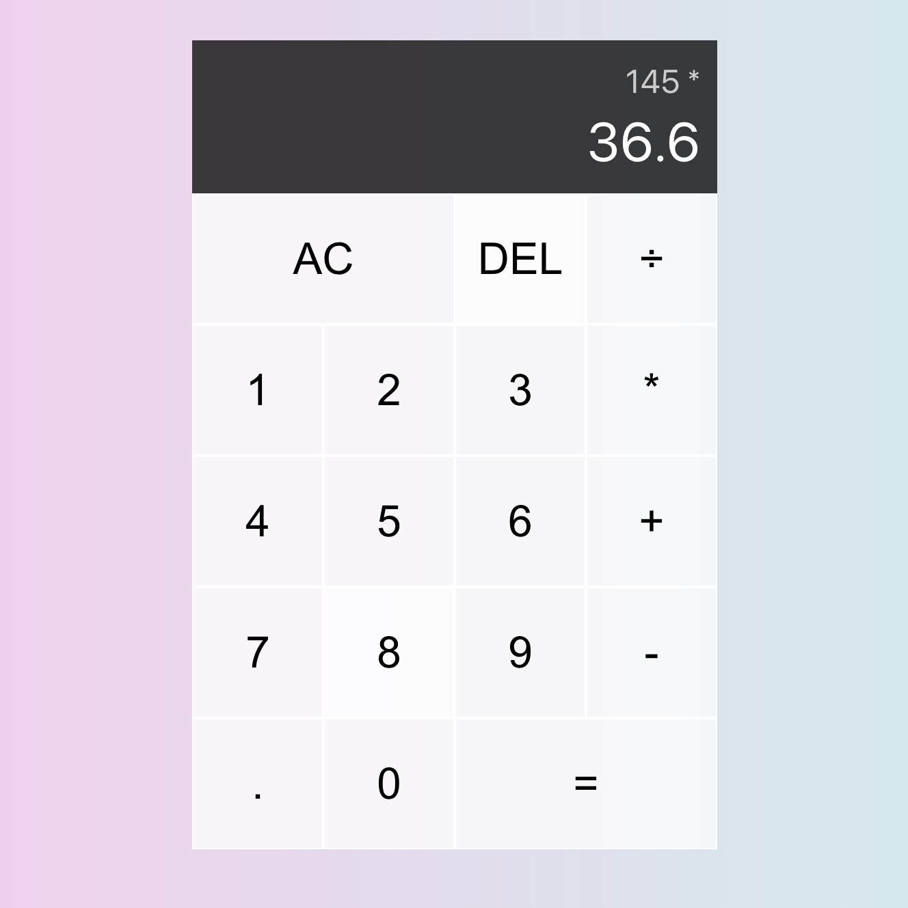

<br/>
<p align="center">
<a href="https://github.com/NigarMohubaliyeva/react-calculator">

</a>
<h3 align="center">Calculator App</h3>
</p>

 

     

 

## About The Project

This project is a calculator application developed with React in a way that allows users to calculate with four operations and has a simple interface.

 

## Built With

 

The Calculator App is a React.js project and was developed in accordance with the ECMAScript 6+ standards of the JavaScript programming language. By using React's useReducer hook, many state definitions can be saved and developed quickly. The interface design has been developed using the "grid" and "flexbox" features of CSS technology and a very modern interface has been developed.

 

* [JavaScript](https://www.w3schools.com/js/)
* [React](https://react.dev/)
* [CSS Grid Layout](https://css-tricks.com/snippets/css/complete-guide-grid/)
* [CSS Flexbox](https://css-tricks.com/snippets/css/a-guide-to-flexbox/)

 

## Getting Started

 

This is an example of how you may give instructions on setting up your project locally.
To get a local copy up and running follow these simple example steps.

 

### Prerequisites

 

This is an example of how to list things you need to use the software and how to install them.

 

* npm

 

```sh
npm install npm@latest -g
```

 

### Installation

 

1. Clone the repo

 

```sh
git clone https://github.com/NigarMohubaliyeva/react-calculator.git
```

 

. Install NPM packages

 

```sh
npm install
```

 

4. Run the project

 

```JS
npm start
```
